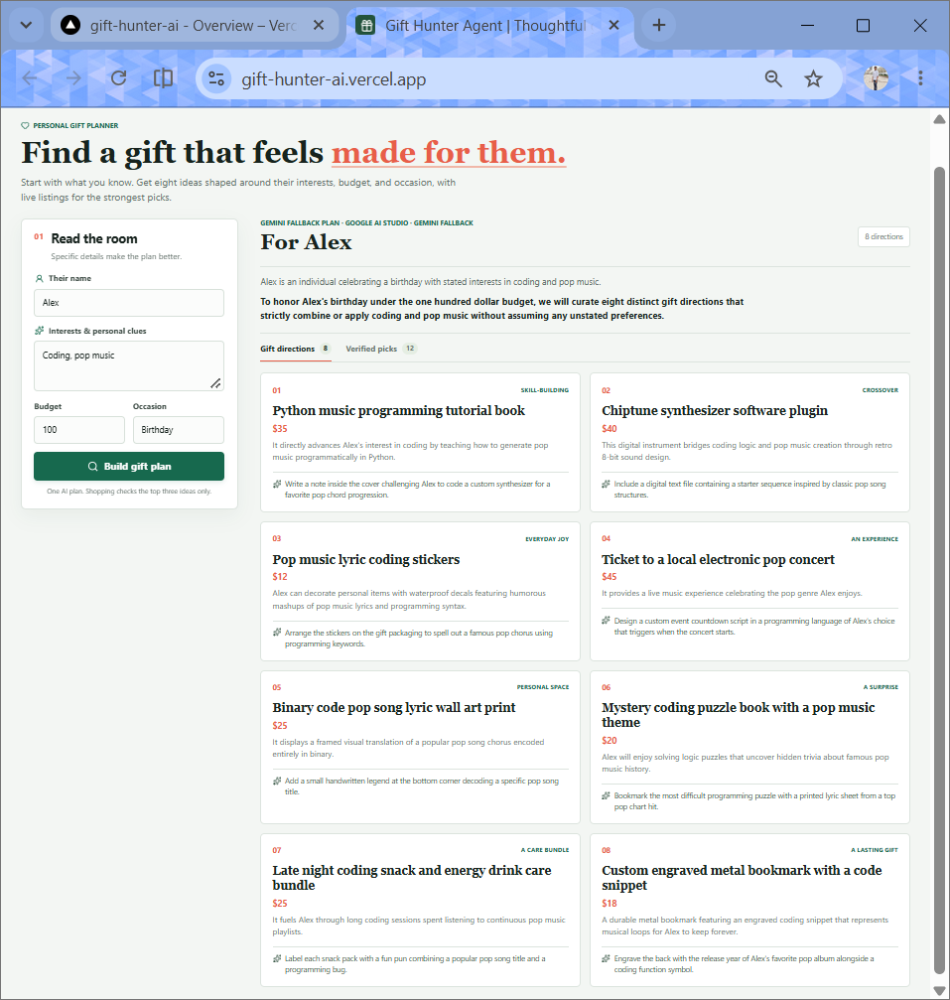
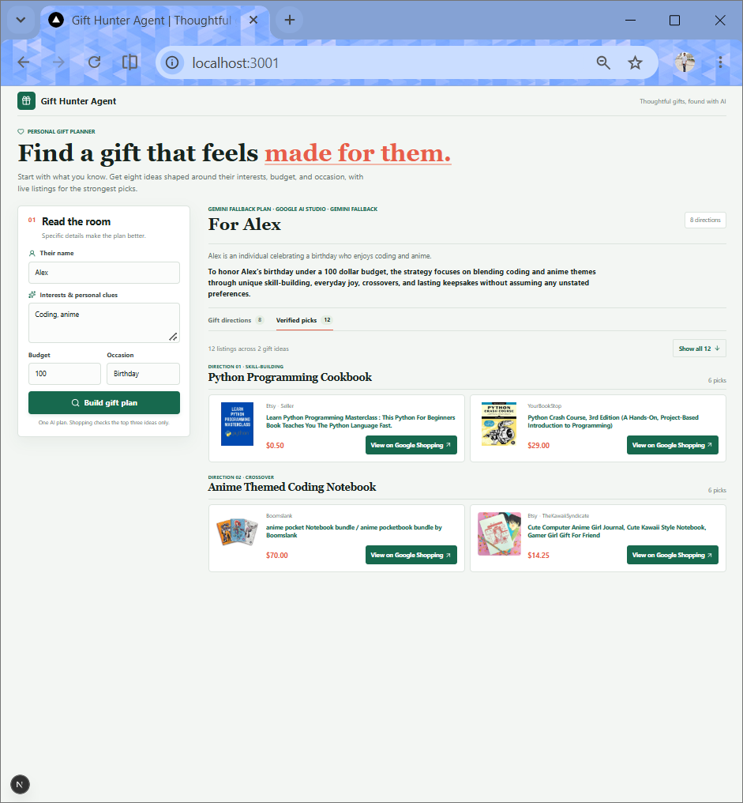
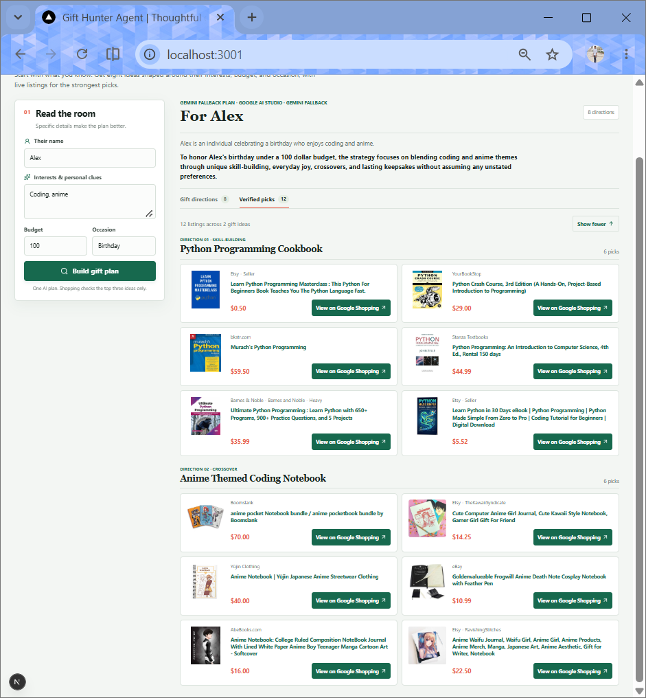
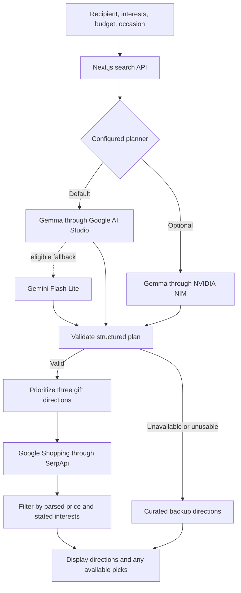

<div align="center">
  <h1>🎁 Gift Hunter Agent</h1>
  <p><b>Thoughtful gifts, chosen for a person rather than a search query.</b></p>
  
  [](https://nextjs.org/)
  [](https://react.dev/)
  [](https://www.typescriptlang.org/)
  [](https://vercel.com/)
  
  <p>
    <a href="https://gift-hunter-ai.vercel.app"><b>Try the live demo</b></a> •
    <a href="https://github.com/JaniDhruv/gift-hunter-ai"><b>View the source</b></a>
  </p>
</div>

---

> Share someone's interests, personal clues, budget, and occasion. Gift Hunter creates eight distinct directions and, when shopping is enabled, finds price- and interest-filtered listings for up to three ideas.

*Built for the [DEV Hacktoberfest Weekend Challenge: Build for a Friend](https://dev.to/challenges/hacktoberfest-weekend-2026-10-01).*

## 💡 The Idea

Gift searches often return a pile of products before helping you decide what would feel personal. Gift Hunter starts with the recipient: their interests, personal clues, budget, and occasion. It turns that brief into a varied shortlist, explains why each idea might fit, and filters product listings against the stated interests and budget.

## 📸 Screenshots

<details>
<summary><b>View Screenshots</b></summary>
<br>

<figure>
  
  <figcaption><strong>Gift directions.</strong> Eight birthday ideas shaped around Alex's coding and pop-music interests and a $100 budget.</figcaption>
</figure>

<figure>
  
  <figcaption><strong>Verified picks.</strong> Product listings are grouped under their corresponding gift ideas.</figcaption>
</figure>

<figure>
  
  <figcaption><strong>Expanded shortlist.</strong> See more listings while keeping each product connected to its gift direction.</figcaption>
</figure>

> **Screenshot note:** These captures show the app's Gemini fallback path. They demonstrate the deployed planning and shopping experience, but do not show a successful Gemma response. The app labels the provider and model used for each plan.
</details>

## ✨ What It Does

| Capability | Behavior |
| :--- | :--- |
| **Recipient-first planning** | Uses the stated interests, personal clues, budget, and occasion to shape the plan. |
| **Eight distinct directions** | Requests a structured plan spanning different kinds of gifts, with a personal reason and a suggested finishing touch for each. |
| **Open-weight model support** | Uses Gemma as the default planner through Google AI Studio; NVIDIA NIM can be selected as an alternative provider. |
| **Live shopping** | Searches Google Shopping through SerpApi for the three highest-priority directions, returning up to six filtered picks per direction. |
| **Budget and relevance checks** | Keeps results with a parseable USD price at or below budget and a title matching at least one stated interest. |
| **Graceful fallback** | If a usable model plan cannot be produced, shows eight curated directions instead. Live product search is skipped for that curated fallback. |
| **Provider visibility** | Shows whether a result came from Gemma, Gemini fallback, or the curated backup path. |

## 🛠️ Technology

| Layer | Technology |
| :--- | :--- |
| **App and API** | Next.js 16 App Router, React 19, TypeScript |
| **Planning** | Google Gen AI SDK, Gemma, Gemini Flash Lite fallback, optional NVIDIA NIM |
| **Shopping** | SerpApi Google Shopping engine |
| **Interface** | Custom CSS and Lucide React icons |
| **Hosting & Analytics** | Vercel and `@vercel/analytics` |
| **Persistence** | MongoDB Atlas contains saved gift-search briefs; the current recommendation pipeline does not query them yet. |

## 🔓 Open-Model Approach

The default configuration targets Gemma, an open-weight model, so the planner is not tied to one closed model or inference provider. This app currently calls hosted inference APIs; it does not download model weights or run inference locally. NVIDIA NIM is an alternate provider path. When the Google-hosted Gemma request cannot be used, Gemini Flash Lite may be used as a clearly labeled fallback; that fallback is a closed model.

> **Note:** For a Gemma-focused demo, configure the primary Gemma path and verify that the result is labeled **Gemma-guided plan**. Do not treat a Gemini fallback result as evidence that Gemma generated that plan.

## 🔌 Integration Status

| Technology | Role in Gift Hunter | Status |
| :--- | :--- | :--- |
| **Gemma** | Generates the structured, personalized gift plan. | Google AI Studio is the default path; the screenshots show the Gemini fallback instead. |
| **SerpApi** | Searches Google Shopping for products related to the three strongest ideas. | Integrated; listings are filtered by price and stated interests. |
| **MongoDB Atlas** | Holds saved gift-search briefs and is intended to support future agent memory and personalization. | The cluster contains records in `gift_hunter.searches`; the current `/api/search` route does not read or write them. |
| **Vercel Analytics** | Counts page views on the deployed app. | Component installed; enable Web Analytics in Vercel project settings. |

## ⚙️ How It Works



1. The browser sends the gift brief to `POST /api/search`.
2. The selected planner is asked for exactly eight directions in a defined JSON schema. Invalid output gets one repair attempt before the curated fallback is used.
3. For a model-generated plan, the three highest-priority, non-overlapping directions become Google Shopping queries.
4. The server filters listings by parseable price, the entered maximum, and title relevance, then groups them under their directions.

> "Verified" means a listing passed those checks. Retailer stock, shipping, final price, and suitability still need to be confirmed on the linked product page.

## 🚀 Use the Demo

1. Enter the recipient's name, interests and personal clues, maximum budget, and occasion.
2. Select **Build gift plan** and review the eight directions.
3. Open **Verified picks** to compare available listings and follow a retailer link for current details.

*Shopping is currently configured for Google Shopping in the United States, and budgets are interpreted as USD.*

## 💻 Run Locally

**Requirements:** Node.js 20.9 or later and npm.

```bash
git clone https://github.com/JaniDhruv/gift-hunter-ai.git
cd gift-hunter-ai
npm ci
```

Create `.env.local` from the example:

```powershell
Copy-Item .env.example .env.local
```
*(On macOS or Linux, use `cp .env.example .env.local` instead.)*

Add the provider keys you plan to use, then start the app:

```bash
npm run dev
```

Open [http://localhost:3000](http://localhost:3000). Next.js may choose another port if 3000 is occupied. Without working model credentials, the interface can still show its curated backup plan. Live shopping requires a SerpApi key.

## 🛠️ Configuration

| Variable | Purpose |
| :--- | :--- |
| `GEMINI_API_KEY` | Google AI Studio credential for the default Gemma planner and Gemini fallback. |
| `GEMMA_PROVIDER` | Planner provider: `google` (default) or `nvidia`. |
| `GEMMA_MODEL` | Google primary model; defaults to `gemma-4-26b-a4b-it`. |
| `GEMINI_FALLBACK_MODEL` | Google fallback model; defaults to `gemini-flash-lite-latest`. |
| `NVIDIA_NIM_API` | NVIDIA NIM credential when `GEMMA_PROVIDER=nvidia`. |
| `NVIDIA_MODEL` | NVIDIA model; defaults to `google/gemma-4-31b-it`. |
| `SERPAPI_KEY` | Enables live Google Shopping searches. |
| `ENABLE_LIVE_SHOPPING` | Set to `false` to disable shopping searches. |
| `ENABLE_NVIDIA_NIM` | Set to `false` to disable NVIDIA NIM. |
| `MONGODB_URI` | Atlas connection string; the current application pipeline does not use this variable yet. |

> **⚠️ Security Note:** Keep real keys in `.env.local` or your deployment provider's secret settings. Never commit them or put them in browser-exposed `NEXT_PUBLIC_` variables.

## 🌐 Deploy and Analytics

The app is deployed at [gift-hunter-ai.vercel.app](https://gift-hunter-ai.vercel.app). To deploy your own copy, import the repository into Vercel, add the required provider keys as server-side environment variables, and deploy. Enable **Web Analytics** for the Vercel project to collect page views; the `<Analytics />` component is already included in the root layout.

## 📊 Data and Current Limits

- Recipient details are sent to the configured inference provider. When shopping is enabled, search terms derived from the gift brief are sent to SerpApi.
- The Atlas cluster already contains saved search briefs in `gift_hunter.searches`. However, the current `/api/search` route does not read from or write to that collection, so those records do not influence generated recommendations yet.
- The app does not currently provide profile or search-history retrieval, saved-product workflows, chat memory, or Atlas Vector Search. The existing records are the starting point for those future capabilities, not proof that they are already part of the live recommendation pipeline.
- Shopping results are filtered with title-based interest matching, not a semantic product classifier. Search results and prices may be incomplete, stale, or imperfectly relevant.
- A seven-day shopping cache exists in server memory per running instance. It is temporary and is not a substitute for persistent storage.
- The public search endpoint has no account-based usage limits. Keep provider credentials server-side and monitor usage with the respective providers.
- Vercel Web Analytics is available after it is enabled in the Vercel project settings.

*Avoid entering sensitive personal information.*

## 🔮 Future Enhancements

- **Friend profiles:** Build reusable, user-controlled profiles from saved search briefs, with clear consent and the ability to edit or delete details.
- **Gift memory and shortlists:** Bookmark listings, keep gift plans, record gifts already given, and learn from feedback to avoid repeats.
- **Memory-aware chat agent:** Ask follow-up questions and use relevant Atlas-backed profile and gift-history context to make recommendations more specific.
- **MongoDB Atlas semantic recall:** Explore Vector Search to find related gifts and preferences when exact words differ.
- **Privacy controls:** Let users inspect, update, export, and delete saved profiles and gift history.

*These are roadmap items, not current capabilities. Atlas currently holds saved search briefs, but connecting those records to the app's recommendation and chat flows is future work.*

## 📁 Project Structure

| Path | Responsibility |
| :--- | :--- |
| `src/app/page.tsx` | Gift brief form, plan display, and shopping results. |
| `src/app/api/search/route.ts` | Model calls, output validation, shopping searches, and listing filters. |
| `src/app/layout.tsx` | App metadata and Vercel Analytics component. |
| `docs/screenshots/` | README screenshots of the deployed experience. |

## ✅ Checks

```bash
npm run lint
npm run build
```
